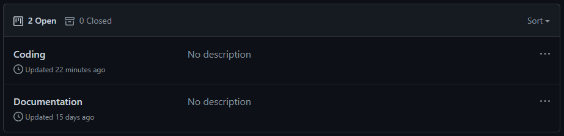
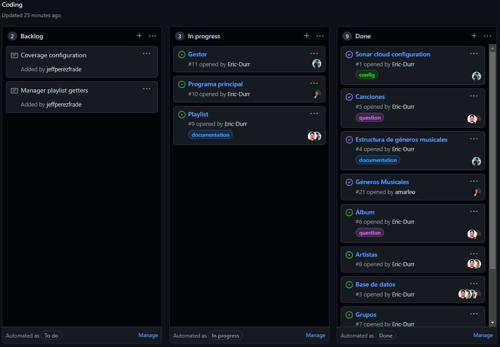

# PRACTICA 7 - Digitalizando la colección de música de los abuelos

>Informe para la asignatura de Desarrollo de Sistemas Informáticos
>
>>**Grupo C** - **Última modificación**: 28/03/2022
>>
>>>[Alejandro Martín de León](alu0101015941@ull.edu.es)
>>>
>>>[Eric Dürr Sierra](alu0101027005@ull.edu.es)
>>>
>>>[Eric Fumero Arteaga](alu0101105741@ull.edu.es)
>>>
>>>[Jeff Pérez Frade](alu0101038520@ull.edu.es)

[](https://coveralls.io/github/ULL-ESIT-INF-DSI-2122/DSI-P06-Eric-Durr-?branch=master)
[](https://sonarcloud.io/summary/new_code?id=ULL-ESIT-INF-DSI-2122_ull-esit-inf-dsi-21-22-prct07-music-datamodel-grupo-c)
***

## [Enlace a la documentación generada con TypeDoc](http://---)

## Indice

- [PRACTICA 7 - Digitalizando la colección de música de los abuelos](#practica-7---digitalizando-la-colección-de-música-de-los-abuelos)
  - [Enlace a la documentación generada con TypeDoc](#enlace-a-la-documentación-generada-con-typedoc)
  - [Indice](#indice)
  - [Introducción](#introducción)
  - [Objetivos](#objetivos)
  - [Actividades previas](#actividades-previas)
  - [Elaboración de la práctica](#elaboración-de-la-práctica)
  - [Conclusiones](#conclusiones)
  - [Referencias](#referencias)
  - [Estructura del directorio](#estructura-del-directorio)
  - [Comandos npm del repositorio](#comandos-npm-del-repositorio)

***

## Introducción
***
En esta práctica se pretende crear un entorno de trabajo en grupo, realizando un ejercicio bastante extenso para así poder definir roles entre los integrantes del grupo. En nuestro caso hicimos uso de las **GitHub Issues** donde cada uno tenía asignada una tarea a realizar en una nueva rama.  Cuando la rama estuviera terminada (con los *tests* pasando) se realizaba una **Pull Request** a la rama *master*. A lo largo del informe se presentan las configuraciones iniciales y las características del diseño así como las decisiones tomadas para desarrollar la lógica de implementación de cada uno de los componentes del ejercicio.

La ejercicio consiste en digitalizar la colección de música de los abuelos, esto es, crear una colección de *Playlists* donde se incluirán una serie de canciones. Toda la estructura estará conformada por *interfaces* y *clases* de Artistas, Grupos, Canciones, Álbumes, Géneros musicales además de un Gestor que permite gestionar el tratamiento avanzado de playlists.

## Objetivos
***
El objetivo de esta práctica es la familiarizarse con la programación cooperativa, aportar puntos de vista en grupo y realizar el ejercicio uniendo las ramas realizadas por cada integrante. Se dispondrá de un entorno de desarrollo donde se implementa el ejercicio comprobado y desarrollado mediante una filosofía dirigida por pruebas/comportamiento (BDD/TDD) y cuyo cubrimiento de código se refleje en un informe. El ejercicio también debe cumplir en la medida de lo posible los principios *SOLID*.
## Actividades previas
***
A parte de las actividades comunes al resto de prácticas (asignación Github Classroom, configuración del repositorio, etc.) en este ejercicio se han incluido **GitHub Actions** para el análisis de Sonar Cloud, el Coverage y el despliegue automático de la **GitHub Page** en la rama `gh-pages`, la cual contiene solo la carpeta `docs`.

Cabe recalcar la importancia del archivo `CONTRIBUTING.md` el cual contiene toda la información para que sea posible la programación colaborativa. Aquí aparecen una serie de reglas a seguir para la *estructura de ramas*, *flujo de trabajo*, *nomenclatura de ramas*, entre otras.

Por último se ha manejado la pestaña de `Projects` de GitHub donde se ha incluido `Coding` y `Documentation`.





- `Coding`: Es parecido a Pivotal Tracker o Trello donde podemos tener una lista de tareas y clasificarlas entre `Backlog`, `In progress` y `Done`.
- `Documentation`: Realiza la misma tarea solamente que este `Project` es solamente para la documentación de los códigos.

## Elaboración de la práctica
***
Para realizar esta práctica lo primero que hemos hecho ha sido plantearnos toda la jerarquía de clases necesarias para el correcto funcionamiento de estas, para ello se han compartido diferentes puntos de vista entre los integrantes del grupo hasta encontrar la opción más óptima.

Con esto claro se ha empezado a realizar la práctica, las decisiones de diseño que se han tomado finalmente han sido estas:

- Clases Song, Album, Genre, Artist y Group: Se tratan de clases estructurales que nos servirán para darle forma a objetos sencillos que contendrán la información básica de cada uno y nos permitirán acceder a ellas con mayor facilidad.
- Clase Playlist: Esta se trata de una clase más compleja ya que contendrá instancias de las clases mencionadas anteriormente para poder simular de una manera más cercana a la realidad una playlist que contiene canciones, artistas, géneros, etc. Además, aparte de ayudarnos a trabajar con la playlist, nos permitirá ordenarla siguiendo diferentes métodos lo que nos facilitará el trabajo más adelante.
- Clase Gestor: En un principio esta iba a tratarse de una clase individual que gestionase el paso de la base de datos (lowdb) a las diferentes clases mencionadas anteriormente, al darnos cuenta de la complejidad de esta clase decidimos realizar una clase gestor para cada clase existente en nuestro proyecto, para así poder gestionar de manera individual la conexión de la base de datos con cada componente de nuestro proyecto.
- Programa principal: Hemos decidido crear un programa principal el cual será el que utilice el módulo Inquirer para mostrar las diferentes opciones que tiene un usuario de navegar por nuestras playlist y diferentes canciones y artistas. Además, este programa será lo único que el usuario podrá "ver" del funcionamiento de nuestro proyecto. Además separaremos este programa en diferentes archivos (por ejemplo: *song.menu.ts*) para poder manejar los menús de Inquirer de una manera más cómoda, limpia y más fácil de comprender.

Tambien hemos añadido un fichero denominado *database.interfaces.ts* que contiene todas las interfaces que utilizamos en nuestro proyecto y así tener nuestro código de la manera más ordenada y organizada posible para facilitar la lectura y comprensión del mismo.

Cabe a destacar que hemos decidido estas decisiones de diseño para tener nuestro código orientado a objetos de la manera más limpia y robusta que posible. Además de esta manera conseguimos que el código sea lo menos vulnerable a errores posible y comseguimos una interconexión real entre las clases realizadas.


## Conclusiones
***
Como futuras mejoras en la practica se podría utilizar un índice para distinguir las canciones en vez de los nombres para poder distinguir cuando una canción se modifica.

Además, nos hemos encontrado con varias dificultades a medida que realizamos la práctica, el primer problema que nos encontramos fue que al usar lowdb@3.0.0 los imports nos daban fallos, aunque lo conseguimos solventar, finalmente nos dimos cuenta que al ejecutar los test seguía existiendo esos fallos por lo que tuvimos que trabajar con la version 1.0.0 de lowdb.

También nos hemos encontrado dificultades a la hora de desarrollar la práctica a la hora de planter cómo ibamos a estructurar nuestras clases y sus funcionalidades ya que aunque no se trate de un proyecto tan complicado intentamos buscar siempre la mejor solución orientada a objetos que podíamos por lo que empleamos mucho tiempo únicamente a plantear el ejercicio.

Además otro problema que nos hemos encontrado es la falta de tiempo efectivo para poder desarrollar de manera limpia y optimizada la práctica del modo que hemos planteado, es decir, nos hubiese gustado añadir alguna opción extra como la mencionada al principio de este punto pero por la falta de tiempo nos hemos visto obligados a descartar dichas opciones.

Finalmente, también ha habido momentos en los que han quedado pocos aspectos en el desarrollo por lo que en algunos momentos hemos optado por realizar *Pair Programming* para que todos podamos trabajar a la vez contrastando ideas y agilizando el desarrollo de nuestra aplicación.
## Referencias
***
[Guión de la práctica](https://ull-esit-inf-dsi-2122.github.io/prct07-music-dataModel/)

## Estructura del directorio
***
```txt
P06/
|____.github/         (Github actions workflow files)
| |____workflows/
| | |____deploy.yml
| | |____runtests.yml
|____dist/            (Transpiled JavaScript code)
|____doc/             (Autogenerated TypeDoc documentation files)
|____docs/            (Assingment report folder)
| |_____config.yml
| |____README.md
|____images/          (Pokemon text images folder)
|____src/             (Source files for TypeScript code exercises)
|____test/            (Test workbench folder)
|____package.json
|____.gitignore
|____.mocharc.json
|____.eslintrc.json
|____typedoc.json
|____tsconfig.json

```

## Comandos npm del repositorio

- npm test  `ejecuta los test unitarios`
- npm run test:watch `inicia la ejecución de los test unitarios de manera ininterrumpida`
- npm run test:coverage `inicia la ejecución de los test junto con la cobertura de código`
- npm run get:coverage `transforma el informe de la cobertura de código en formato lcov`
- npm run build `ejecuta los test y traduce el código TypeScript a JavaScript`
- npm run docs `Genera la documentación de código con TypeDoc del código fuente`
