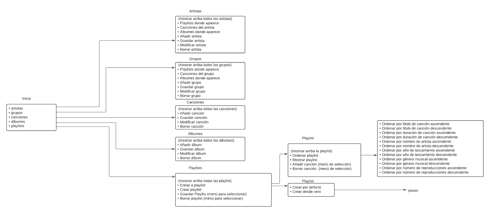

# PRACTICA 7 - Digitalizando la colección de música de los abuelos

>Informe para la asignatura de Desarrollo de Sistemas Informáticos
>
>>**Grupo C** - **Última modificación**: 28/03/2022
>>
>>>[Alejandro Martín de León](alu0101015941@ull.edu.es)
>>>
>>>[Eric Dürr Sierra](alu0101027005@ull.edu.es)
>>>
>>>[Eric Fumero Arteaga](alu0101105741@ull.edu.es)
>>>
>>>[Jeff Pérez Frade](alu0101038520@ull.edu.es)

[](https://coveralls.io/github/ULL-ESIT-INF-DSI-2122/DSI-P06-Eric-Durr-?branch=master)
[](https://sonarcloud.io/summary/new_code?id=ULL-ESIT-INF-DSI-2122_ull-esit-inf-dsi-21-22-prct07-music-datamodel-grupo-c)
***

## [Enlace a la documentación generada con TypeDoc](http://dsi-p07-code-docs.surge.sh/modules.html)

## Indice

- [PRACTICA 7 - Digitalizando la colección de música de los abuelos](#practica-7---digitalizando-la-colección-de-música-de-los-abuelos)
  - [Enlace a la documentación generada con TypeDoc](#enlace-a-la-documentación-generada-con-typedoc)
  - [Indice](#indice)
  - [Introducción](#introducción)
  - [Objetivos](#objetivos)
  - [Actividades previas](#actividades-previas)
  - [Elaboración de la práctica](#elaboración-de-la-práctica)
  - [Uso del menú](#uso-del-menú)
  - [Conclusiones](#conclusiones)
  - [Referencias](#referencias)
  - [Estructura del directorio](#estructura-del-directorio)
  - [Comandos npm del repositorio](#comandos-npm-del-repositorio)

***
## Introducción
***
En esta práctica se pretende crear un entorno de trabajo en grupo, realizando un ejercicio bastante extenso para así poder definir roles entre los integrantes del grupo. En nuestro caso hicimos uso de las **GitHub Issues** donde cada uno tenía asignada una tarea a realizar en una nueva rama.  Cuando la rama estuviera terminada (con los *tests* pasando) se realizaba una **Pull Request** a la rama *master*. A lo largo del informe se presentan las configuraciones iniciales y las características del diseño así como las decisiones tomadas para desarrollar la lógica de implementación de cada uno de los componentes del ejercicio.

La ejercicio consiste en digitalizar la colección de música de los abuelos, esto es, crear una colección de *Playlists* donde se incluirán una serie de canciones. Toda la estructura estará conformada por *interfaces* y *clases* de Artistas, Grupos, Canciones, Álbumes, Géneros musicales además de un Gestor que permite gestionar el tratamiento avanzado de playlists.

## Objetivos
***
El objetivo de esta práctica es la familiarizarse con la programación cooperativa, aportar puntos de vista en grupo y realizar el ejercicio uniendo las ramas realizadas por cada integrante. Se dispondrá de un entorno de desarrollo donde se implementa el ejercicio comprobado y desarrollado mediante una filosofía dirigida por pruebas/comportamiento (BDD/TDD) y cuyo cubrimiento de código se refleje en un informe. El ejercicio también debe cumplir en la medida de lo posible los principios *SOLID*.
## Actividades previas
***
A parte de las actividades comunes al resto de prácticas (asignación Github Classroom, configuración del repositorio, etc.) en este ejercicio se han incluido **GitHub Actions** para el análisis de Sonar Cloud, el Coverage y el despliegue automático de la **GitHub Page** en la rama `gh-pages`, la cual contiene solo la carpeta `docs`.

Cabe recalcar la importancia del archivo `CONTRIBUTING.md` el cual contiene toda la información para que sea posible la programación colaborativa. Aquí aparecen una serie de reglas a seguir para la *estructura de ramas*, *flujo de trabajo*, *nomenclatura de ramas*, entre otras.

Por último se ha manejado la pestaña de `Projects` de GitHub donde se ha incluido `Coding` y `Documentation`.


- `Coding`: Es parecido a Pivotal Tracker o Trello donde podemos tener una lista de tareas y clasificarlas entre `Backlog`, `In progress` y `Done`.
- `Documentation`: Realiza la misma tarea solamente que este `Project` es solamente para la documentación de los códigos.

Un detalle importante a comentar es que se recomienda hacer uso de la versión **v16.14.2 de NodeJs** para garantizar el buen funcionamiento del proyecto.

## Elaboración de la práctica
***
Para realizar esta práctica lo primero que hemos hecho ha sido plantearnos toda la jerarquía de clases necesarias para el correcto funcionamiento de estas, para ello se han compartido diferentes puntos de vista entre los integrantes del grupo hasta encontrar la opción más óptima.

Con esto claro se ha empezado a realizar la práctica, las decisiones de diseño que se han tomado finalmente han sido estas:

- Clases Song, Album, Genre, Artist y Group: Se tratan de clases estructurales que nos servirán para darle forma a objetos sencillos que contendrán la información básica de cada uno y nos permitirán acceder a ellas con mayor facilidad.
- Clase Playlist: Esta se trata de una clase más compleja ya que contendrá instancias de las clases mencionadas anteriormente para poder simular de una manera más cercana a la realidad una playlist que contiene canciones, artistas, géneros, etc. Además, aparte de ayudar a la hora de trabajar con la playlist, permitirá ordenarla siguiendo diferentes métodos lo que nos facilitará el trabajo más adelante.
- Clase Gestor: En un principio esta iba a tratarse de una clase individual que gestionase el paso de la base de datos (lowdb) a las diferentes clases mencionadas anteriormente. Sin embargo debido de la complejidad que podría haber tenido esta clase, se ha decidido realizar una clase gestor para cada clase existente en el proyecto, para así poder gestionar de manera individual la conexión de la base de datos con cada componente.
- Programa principal: Se ha decidido crear un programa principal el cual será el que utilice el módulo Inquirer para mostrar las diferentes opciones que tiene un usuario de navegar por las playlist, canciones, álbumes, entre otros elementos del sistema. El programa principal se ha separado en diferentes archivos (por ejemplo: *song.menu.ts*) para poder manejar los menús de Inquirer de una manera más cómoda, limpia y más fácil de comprender.

Tambien se ha añadido un fichero denominado *database.interfaces.ts* que contiene todas las interfaces que se utilizarán en el proyecto, y así tener el código de la manera más ordenada y organizada posible para facilitar la lectura y comprensión del mismo.

Cabe a destacar que se han decido ciertas desiciones en cuanto al diseño para tener un menú de la manera más limpia y robusta que posible. Además de esta manera conseguimos que el código sea lo menos vulnerable a errores posible y comseguimos una interconexión real entre las clases realizadas.


## Uso del menú
***

Para este problema se ha propuesto el uso del módulo de npm **inquirerJS**. Con este se ha podido llevar a cabo un menú interactivo, sobre el que se han expuesto las diferentes operaciones para cada uno de los elementos del proyecto. Para poder entrar en el menú, se hará uso del comando: 

```bash
npm run main
```

Con esto, en la terminal se mostrará la parte principal del menú. A continuación se puede ver un pequeño ejemplo de lo que muestra: 

```bash
? What do you want to do? (Use arrow keys)
❯ Artists 
  Genres 
  Groups 
  Songs 
  Albums 
  Playlists 
  ──────────────
(Move up and down to reveal more choices)


```

Con las flechas del teclado se podrá acceder a los diferentes elementos del proyecto. Por cada página se ha creado la funcionalidad de retornar en el menú (Go Back).

Siguiendo el ejemplo anterior, si se accede al elemento **Song**, se muestra la siguiente información:

```bash
22:45:53 - Found 0 errors. Watching for file changes.
? What do you want to do? Songs
? Choose an action: (Use arrow keys)
❯ List all songs 
  Add new song 
  Save song 
  Edit song 
  Delete song 
  ──────────────
  Go Back 

```

Como se puede observar, se crea una nueva pregunta al usuario. En este caso, se trata de las diferentes operaciones que se permiten realizar con las canciones. Abajo, se encuentra la anteriormente comentada opción (Go Back). El resto del menú trabaja de forma similar al ejemplo expuesto en este apartado. 

Para continuar con el funcionamiento del menú, en este caso se va a añadir una nueva canción al listado de Canciones. A continuación seleccionando la opción **Add new song**, se muestra un formulario que una vez rellenado, creará una nueva canción: 

```bash
23:11:40 - Found 0 errors. Watching for file changes.
? What do you want to do? Songs
? Choose an action: Add new song
? Type new name: Mucho
? Type new artist: Bejo
? Type new seconds: 231
? Type new genres: Hip-Hop
? Is a single?: No
? Type new views: 500500
```

La canción creada de momento no ha sido almacenada en la base de datos. Para que esto suceda será necesario usar la opción **save song**. De forma automática se redirigirá al usuario a la pantalla anterior, donde se ha de poder seleccionar dicha opción.

Una vez seleccionada, se podrá ver como aparece la canción creada. Se ha controlado de forma que sólamente aparezca un listado de las canciones que no han sido guardadas en la base de datos.

```bash
? Choose an action: Save song
? Select a song to save: (Use arrow keys)
❯ Mucho 
  ──────────────
  Go Back 

```
Al seleccionar esta canción, se confirmará el almacenamiento en la base de datos. Dentro del fichero **database-songs.json** se podrá observar cómo se ha añadido una nueva canción: 

```bash
    [...]
    {
      "name": "Mucho",
      "artists": "Bejo",
      "seconds": 231,
      "genres": [
        "Hip-Hop"
      ],
      "single": false,
      "views": 500500,
      "origin": "User"
    }
```

Como se puede observar, no sólo se han cargado los datos introducidos por el usuario, sino que, además, se ha determinado a través de la clave "origin" el dato "User", determinando de esta manera que el ha sido creado por el usuario. En este mismo fichero se encuentran el resto de canciones que han sido creadas por defecto. Para estas canciones, se ha establecido la clave origin con "system". Esta misma idea se ha trasladado al resto de elementos.

Continuando con el ejemplo práctico del proyecto, se procede a hacer uso de la opción **edit song**. Seleccionando esta opción se muestra un formulario similar al ya visto en el momento de añadir una canción. Se muestra un listado de las canciones que tienen permitido ser editadas (Las etiquetadas como User), y, seleccionando la deseada a editar, se muestra el formulario: 

```bash


```
? Select a song to Edit: Mucho
? Edit artist: Bejo
? Edit seconds: 99
? Edit genres: Rap
? Is a single?: Yes
? Edit views: 9090909090

```bash

    {
      "name": "Mucho",
      "artists": "Bejo",
      "seconds": 99,
      "genres": [
        null
      ],
      "single": true,
      "views": 9090909090,
      "origin": "User"
    }
```

Como se puede observar en el caso anterior, se puede ver como han sido reflejados los cambios en la base de datos. 

Finalmente, se comprueba el uso del comando Delete. Como ya se ha realizado con otros, al seleccionar la opcion **Delete Song**, se mostrará un listado de las canciones que se permite borrar por el usuario. Una vez seleccionada, se puede observar como la canción ha desaparecido de la base de datos. 

## Conclusiones
***
Como futuras mejoras en la practica se podría utilizar un índice para distinguir las canciones en vez de los nombres para poder distinguir cuando una canción se modifica.

Además, durante el trascurso del proyecto, han surgido varias dificultades, el primer problema que ha resultado de importancia, es el de la versión de Lowdb utilizada. En este caso, se intentó hacer uso de **lowdb@3.0.0**, sin embargo los imports resultaban ciertos fallos. Esto se creayó haber conseguido resolver, sin embargo finalmente al intentar ejecutar los test seguía existiendo errores. Es por esto por lo que se acabó optando por utilizar lowdb@1.0.0.

Otras dificultades a destacar que se han encontrado, fue el de la estructura inicial de clases y sus funcionalidades. Al tratarse de un proyecto tan extenso y interconectado entre sí, complicó la forma en la que afrontar el problema. Sin embargo, tras algunas reuniones entre los integrantes del grupo, se encontró una solución viable.

Por otro lado, otro problema que se ha encontrado es la falta de tiempo efectivo para poder desarrollar de manera limpia y optimizada la práctica del modo que hemos planteado. En ciertas partes del código nos hubiese gustado añadir alguna opción extra como la mencionada al principio del documento, así como poder elaborar todo el menú y sus opciones con aún más precisión.

Finalmente, también ha habido momentos en los que han quedado pocos aspectos en el desarrollo por lo que en algunos momentos hemos optado por realizar *Pair Programming* para que todos podamos trabajar a la vez contrastando ideas y agilizando el desarrollo de nuestra aplicación.
## Referencias
***
[Guión de la práctica](https://ull-esit-inf-dsi-2122.github.io/prct07-music-dataModel/)

## Estructura del directorio
***
```txt
P06/
|____.github/         (Github actions workflow files)
| |____workflows/
| | |____deploy.yml
| | |____runtests.yml
|____dist/            (Transpiled JavaScript code)
|____doc/             (Autogenerated TypeDoc documentation files)
|____docs/            (Assingment report folder)
| |_____config.yml
| |____README.md
|____images/          (Pokemon text images folder)
|____src/             (Source files for TypeScript code exercises)
|____test/            (Test workbench folder)
|____package.json
|____.gitignore
|____.mocharc.json
|____.eslintrc.json
|____typedoc.json
|____tsconfig.json

```

## Comandos npm del repositorio

- npm test  `ejecuta los test unitarios`
- npm run test:watch `inicia la ejecución de los test unitarios de manera ininterrumpida`
- npm run test:coverage `inicia la ejecución de los test junto con la cobertura de código`
- npm run get:coverage `transforma el informe de la cobertura de código en formato lcov`
- npm run build `ejecuta los test y traduce el código TypeScript a JavaScript`
- npm run docs `Genera la documentación de código con TypeDoc del código fuente`
